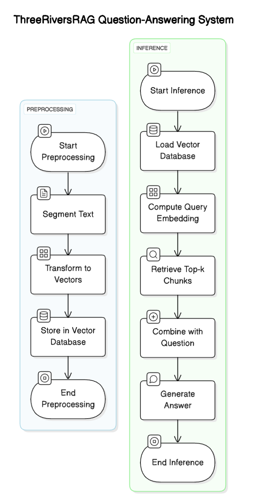
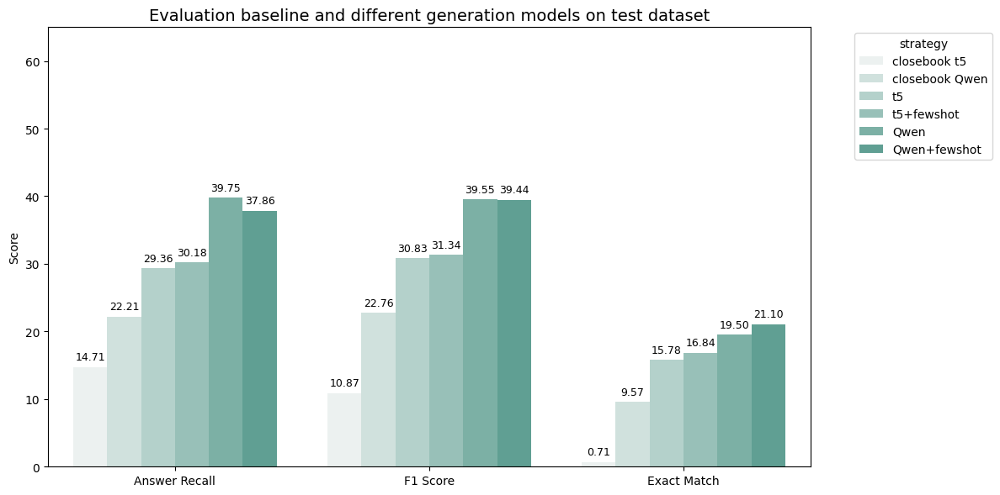

# ThreeRiversRAG

Retrieval-Augmented Generation (RAG) is a powerful solution to the knowledge limitations of large language models (LLMs), especially for domain-specific question answering. In this project, we design and implement a full RAG pipeline focused on answering questions about Pittsburgh and Carnegie Mellon University (CMU). Our system includes comprehensive data collection, preprocessing, and annotation, with quality evaluated using Inter-Annotator Agreement (IAA). We compare large-scale models (e.g., Llama, Qwen) with smaller ones to assess their effectiveness in knowledge-intensive tasks. Additionally, we analyze how retrieval strategies and prompt design influence the accuracy and relevance of generated answers, underscoring the importance of retrieval and prompt tuning in domain-specific QA systems.

## RAG Pipeline

<p align="center">
  
</p>

### Steps to run

1. Download the [retrieval source data](https://drive.google.com/file/d/1lMoaDjDPWwakgPRESt_u__5rQUg55zz-/view?usp=sharing) and place it in data folder.
2. Enter src folder: `cd src`.
3. Install the relevant packages: `pip install -r requirements.txt`
4. Run RAG pipeline
    ```
    python rag.py \
    --retrieval_dir ../data/retrieve_source \
    --annotation_csv ../data/test/annotation_test_v3.csv \
    --embedder_model_name 'sentence-transformers/all-MiniLM-L6-v2' \
    --generation_model_name 'Qwen/Qwen2-7B-Instruct' \
    --vectorstore_type faiss
    ```

## Results
We evaluate the performance of our closed-book baseline, small language model (SLM), and large language model (LLM) under different generation strategies. As shown in Figure, our RAG-based methods consistently outperform the closed-book baselines across all evaluation metrics—Answer Recall, F1 Score, and Exact Match. Among the models, the Qwen-based LLM achieves overall better performance than the T5-based SLM. Interestingly, introducing few-shot examples improves the performance of the T5 model, particularly in Answer Recall and F1 Score. In contrast, few-shot prompting slightly reduces performance for the Qwen model, suggesting that larger models may be more sensitive to prompt structure or redundancy in simpler tasks.

